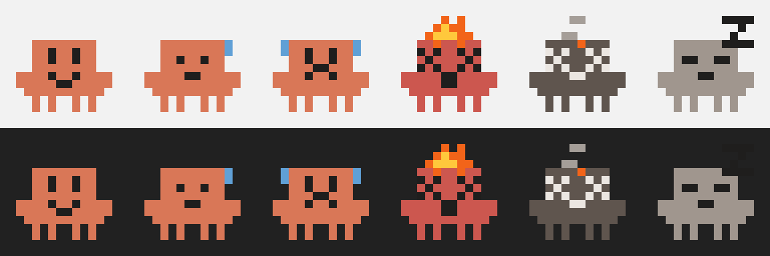

# Claude Usage — macOS menu bar app

A tiny native menu bar app that shows your Claude usage limits at a glance.

The menu bar shows the little Claude Code pixel critter, whose mood tracks
your **peak** utilization (the higher of the 5-hour session limit and the
7-day weekly limit), next to the percentage:



| State | When | Look |
|---|---|---|
| Happy | < 40% | smiling |
| Working hard | 40–74% | focused, one sweat drop |
| Stressed | 75–89% | frowning, two sweat drops; % turns orange |
| Overwhelmed | ≥ 90% | X-eyes, on fire, red-shifted body; % turns red |
| Asleep | error / not logged in | gray, eyes closed, Z |

The mascot is drawn entirely in code on a 12×12 pixel grid — no image
assets — and rasterized at 2x so it stays crisp on retina menu bars.

Click it for the full breakdown:

- Current session (5-hour) — % used + reset time
- Weekly (7-day, all models) — % used + reset time
- Weekly Opus / Sonnet (when applicable)
- Extra usage credits (used / monthly limit)

## Build

```sh
./build.sh
open ClaudeUsage.app
```

Requires the Swift toolchain (ships with Xcode / Command Line Tools). Produces a
standalone, dependency-free `ClaudeUsage.app`.

## How it works

- Reads your Claude Code OAuth token from the login Keychain item
  `Claude Code-credentials` (the same one the `claude` CLI uses).
- Polls `https://api.anthropic.com/api/oauth/usage` every 2 minutes.
- Refreshes the access token automatically when it's near expiry and writes the
  rotated credentials back to the Keychain (kept in sync with the CLI).

No data leaves your machine except the usage request to Anthropic. There is no
config and nothing is stored on disk.

## Privacy & trust

This app is intentionally tiny so it's easy to audit (`Sources/main.swift` is the
whole thing).

- **Your credentials never leave your Mac.** The app reads the existing
  `Claude Code-credentials` Keychain item that the official `claude` CLI created;
  it does not create accounts, prompt for passwords, or store tokens anywhere.
- **It talks only to Anthropic.** The single network call is the usage request to
  `api.anthropic.com` (plus a token refresh to `console.anthropic.com` when
  needed) — no analytics, telemetry, or third-party servers.
- **No secrets are baked into the repo or binary.** The only credential-like value
  in the source is the *public* Claude Code OAuth `client_id`, the same one
  shipped in the CLI.
- On first token refresh, macOS may show a one-time Keychain prompt for the
  write-back — click **Always Allow** for unattended operation.

## Run at login

System Settings → General → Login Items → add `ClaudeUsage.app`. Because
`LSUIElement` is set, it runs with no Dock icon — menu bar only.

## Demo mode

```sh
open ClaudeUsage.app --args --demo
```

Cycles synthetic usage values every 3 seconds (happy → working → stressed →
on fire) — handy for screenshots and screen recordings. In demo mode no
credentials are read and no network calls are made.

## Quit

Click the menu bar item → **Quit** (⌘Q), or `pkill -x ClaudeUsage`.
